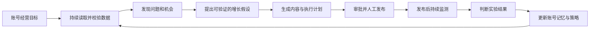

# 同舟行 · 自主运营系统 V4

## 文档状态

- 状态：方向已确认，待拆分实施计划
- 日期：2026-08-03
- 目标用户：抖音代运营团队
- 产品阶段：V3 主 Agent 运行底座之上的下一阶段产品方向

## 问题定义

如何让抖音代运营团队用更少的人力管理更多账号，由 Agent 持续完成数据诊断、内容策划、生产、发布、监测和调整，并对经营结果负责？

当前 V3 已经建立主 Agent、Skill、专家 Agent、Tool、权限门、成果与执行 Runtime 等基础能力，但主要工作模式仍然是“用户提出一次任务，系统完成一次任务”。V4 要完成的关键跨越是：从一次性任务助手升级为持续经营账号的自主运营系统。

## 目标用户与核心工作

核心用户是同时服务多个抖音账号的代运营团队。

当团队需要持续经营客户账号时，希望把重复的数据检查、选题策划、内容生产、发布和复盘工作交给系统，让运营人员只处理目标设定、例外情况、高风险审批和客户沟通，从而：

- 减少重复运营人力；
- 提高可发布内容产量；
- 改善账号增长指标；
- 改善线索、成交等业务指标；
- 在不牺牲账号安全和品牌质量的前提下扩大可管理账号数量。

## 推荐方向

把运营大脑从“任务型助手”升级成“长期经营者”。

每个账号拥有独立的经营目标、长期记忆、数据状态、实验记录、内容计划、权限和成果。主 Agent 主动发现问题、安排执行、监测结果；运营人员从亲自操作转变为监督例外和高风险决策。

产品形态按以下层级组合：

- 产品外壳：账号舰队指挥中心；
- 每个账号：自主运营单元；
- 决策核心：增长实验引擎；
- 用户入口：AI 运营总监；
- 执行方式：数字运营团队；
- 最终交付：结果委托；
- 长期壁垒：代运营知识飞轮。

其中 V4 只聚焦证明“账号自主运营单元”能够成立，舰队规模化和跨账号知识飞轮分别放在后续阶段。

## 核心经营闭环

主 Agent 不再只等待用户提问，而要主动回答：

- 哪些账号今天需要处理；
- 为什么需要处理；
- 准备采取什么行动；
- 哪些动作可以自动执行；
- 哪些动作需要人工批准；
- 执行后指标发生了什么变化；
- 下一轮应该放大、修改还是停止。

## 成功定义

“任意指标提高”只有在满足保护条件时才算成功：

> 相比明确基线，至少一个选定目标指标产生有意义的提升，同时账号安全、品牌质量、运营成本等保护指标没有显著恶化。

每个账号在一个经营周期内只设置一个主目标：

- 成交或有效线索；
- 粉丝净增长；
- 有效播放和互动；
- 内容生产效率；
- 人工投入时长。

其他指标作为辅助指标或保护指标，避免系统在不同目标之间频繁切换，也避免为了播放量制造低价值内容。

V4 的阶段性验证标准：

- Agent 成果采用率达到 70% 以上；
- 单账号人工投入时间降低至少 50%；
- 内容产量提升至少 50%，质量保护指标不下降；
- 至少一个选定经营指标相对基线提升 10%；
- 自动执行不产生严重误发、违规或跨账号数据污染；
- 模型和生产成本显著低于节省的人工成本。

这些数值是需要通过真实试点验证的产品假设，不是上线前已经成立的事实。

## 关键假设与验证方式

- [ ] 数据足够可信和及时：选择真实账号连续运行数据质量巡检，记录缺失、延迟、冲突和不可归因数据比例。
- [ ] 内容成果达到可发布水平：统计直接采用、小幅修改、完全重做和拒绝四类结果，而不是仅统计生成次数。
- [ ] 行动能够连接结果：为每次内容、策略和发布动作建立实验记录，验证系统能否形成可信的行动—结果链路。
- [ ] 团队愿意授权自动执行：分别测试建议模式、审批模式和受限自动模式，观察不同风险等级的真实采用率。
- [ ] 自动调整不会追逐虚荣指标：使用主目标、辅助指标和保护指标共同约束每轮决策。
- [ ] 节省人力大于系统成本：同时记录人工时长、模型费用、内容生产费用和异常处理成本。

## V4 首期范围

- 抖音单平台；
- 每个账号独立的长期经营状态和数据边界；
- 每周或每月一个主经营目标；
- 每日任务与数据新鲜度巡检，并在新数据导入后自动完成数据分析；
- 普通账号每周完整导入，新作品在发布后第 1、3、7 天补充关键表现数据；
- 问题和机会优先级排序；
- 运营人员维护账号级对标库，主 Agent 基于链接、截图和公开材料完成深度分析与合规改编；
- 自动生成运营假设、预期指标和行动计划；
- 调用定位、策略、编导、视觉、发布和数据专家；
- 完整发布包、排期和可追踪的人工发布任务；
- 实验台账与内容版本、发布时间、执行动作关联；
- 发布后 24 小时、72 小时和 7 天监测；
- 自动生成复盘结论和下一轮动作；
- 异常、风险或证据不足时主动请求人工处理；
- 运营者可以随时暂停、修改目标或接管账号；
- 所有对话、成果、记忆、执行日志和权限严格按账号隔离。

## 暂时不做

- **同时支持多个平台**：先把抖音链路做到可信、有效和可复制。
- **自动持续抓取对标账号**：V4 由运营人员选定对标材料，避免依赖不稳定或不合规的数据采集方式。
- **所有行业通吃**：先选择少量真实账号验证完整经营闭环。
- **无限专家嵌套**：复杂编排不等于业务效果，专家保持单层隔离执行。
- **自动发布抖音内容**：V4 由运营人员手动发布，避免核心闭环依赖不稳定的浏览器自动化、RPA 或非官方接口。
- **无边界全自动**：品牌、预算、账号安全相关动作保留权限门、频率限制和紧急停止。
- **只增加漂亮数据看板**：没有行动和结果反馈的数据不产生核心价值。
- **只追求播放量**：播放增长不能以成交、账号定位和内容质量下降为代价。
- **直接建设百账号舰队**：先证明一个账号可以被持续经营，再进行规模化。
- **用专家数量定义能力**：正式能力以可采用成果、执行结果和指标改善衡量。

## 主要失败风险

- 数据来源不完整，系统却给出过度确定的判断；
- 生成内容很多，但人工采用率很低；
- 发布执行退化为批量发内容，没有形成实验和学习；
- 为追求单一指标损害账号定位、品牌质量或成交；
- 每个账号仍需要大量人工纠正，实际没有减少人力；
- 第三方平台权限或数据能力不足，导致闭环在发布或监测处断开；
- 模型、视频生产和审核成本超过被节省的人工成本；
- 跨账号数据、成果或长期记忆发生污染。

## 阶段路线

- **V4：账号自主运营单元**——证明一个账号能够被持续、可信地经营。
- **V5：账号舰队与异常指挥中心**——证明一个运营人员能够监督多个自主账号。
- **V6：代运营知识飞轮**——在客户数据严格隔离的前提下沉淀行业基准、有效模式和失败经验。

## 开放问题

- 首批试点选择哪些账号和行业？
- 主目标由谁设定，按周还是按月调整？
- 哪些发布和互动动作可以进入受限自动模式？
- 成交和有效线索数据通过什么来源接入和归因？
- 账号级实验的对照基线如何建立？
- 内容质量和品牌一致性的保护指标如何量化？
- 发生异常时，谁接管、多久必须响应、系统如何安全降级？
