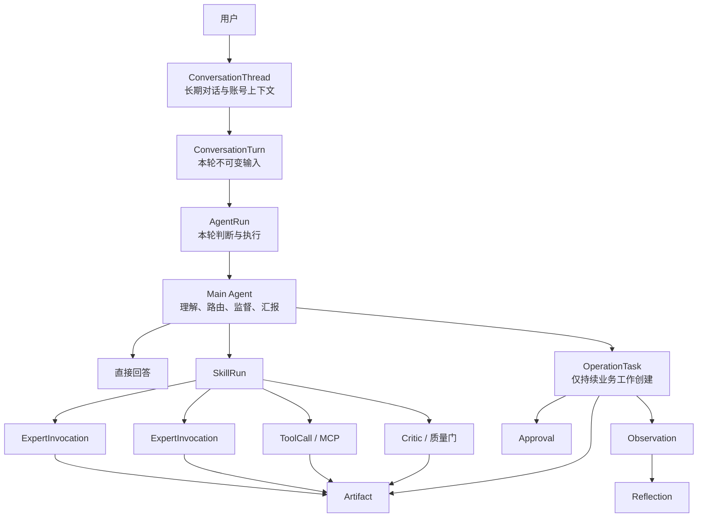

# 同舟行 Main Agent V2：全链路运营闭环设计

> 状态：已确认产品意图，进入技术计划前评审
>
> 日期：2026-07-28
>
> 决策记录：`docs/adr/0003-main-agent-v2-conversation-skill-runtime.md`
>
> 相关基线：`PRODUCT.md`、`SPEC.md`、`DESIGN.md`、ADR 0001、ADR 0002
>
> 实施方式：增量迁移，保留现有 BrainTask、运行账本、权限门和真实平台能力

## 1. 已确认的产品意图

同舟行的主 Agent 不是一个只负责回答问题的聊天机器人，而是账号运营的统一工作台和 AI 运营负责人。

运营者只需要通过自然语言说明问题或目标，就可以从运营链路的任意位置进入。主 Agent 自动判断当前请求属于普通问答、数据查询、正式运营任务还是高风险动作，并选择或组合相应 Skill、专家 Agent 和 Tool。

最终体验必须满足：

- 主 Agent 覆盖账号诊断、定位、策略、选题、脚本、发布准备、执行跟踪、数据复盘和持续优化。
- 运营过程中出现的任何问题都可以先交给主 Agent 理解、定位和推进。
- 普通问答回答完即结束；正式运营任务必须形成成果、下一步和后续观察。
- 主 Agent 深度参与数据复盘，解释原因、识别机会、提出建议，并追踪建议是否有效。
- 用户不需要理解 Skill、专家编排、Tool 或 Runtime 才能使用系统。
- 新平台、MCP、专家和业务能力可以持续接入同一个主 Agent。

一句话定义：

> 让运营者通过一个主 Agent，以清晰的对话方式完成账号运营全链路；任何运营问题都能从这里进入、被专业处理、形成可见成果，并持续推进到数据复盘和下一轮优化。

## 2. 当前问题

当前实现把长期对话、单轮消息、一次 Agent 运行、正式业务目标和成果容器合并到了 `BrainTask`：

```text
用户消息
  -> 复用账号下同一个 BrainTask
  -> 覆盖任务 brief 和规划状态
  -> analysis/workflow/action 进入完整 AI COO 图
  -> 历史策略、成果和验收记录在最新消息底部重新投影
```

这会产生以下用户问题：

- 普通数据问题也可能生成“30 天运营策略”。
- 后续消息复用旧策略，用户无法判断策略来自哪一轮。
- 历史成果随最新消息移动，完成状态与成果位置脱节。
- “正式成果”“重做中”“采用成果”等状态和动作语义不清。
- 成果卡展示内部 Schema 字段和通用英文占位内容，而不是可使用的运营结论。
- 系统显示任务完成，但用户不知道交付了什么、保存在哪里、下一步是什么。

Main Agent V2 首先修复归属模型，再扩展 Skill 和专家能力。不能只通过修改 Prompt 或隐藏卡片解决问题。

## 3. 成功标准

### 3.1 产品成功标准

- 用户可从运营链路任意环节开始对话。
- 主 Agent 自动判断“直接回答”或“推进任务”，不要求用户预先选择模式。
- 每个正式任务都有清晰的执行阶段、参与专家、正式成果和下一步。
- 用户不再出现“为什么弹出这个”“它完成了什么”“成果在哪里”的困惑。
- 正式成果在来源对话和成果中心均可访问，且两处引用同一个成果对象。
- 主 Agent 可以基于新数据继续复盘，而不是在生成建议后结束。
- 高风险外部动作始终经过用户确认。

### 3.2 技术成功标准

- 每条用户消息创建独立 `ConversationTurn` 和幂等 `AgentRun`。
- 普通问答和简单查询不创建 `OperationTask`。
- Strategy、Artifact、Approval、Observation 和 Reflection 可追溯到来源 Turn/Run。
- 前端按 Turn 投影消息、进度、专家、审批和成果。
- Skill、专家和 Tool 使用统一 Runtime、权限、事件和审计边界。
- 现有 `/brain/tasks/*`、历史数据和真实平台链路在迁移期间继续可用。

## 4. 产品交互

### 4.1 一个入口，两种工作形态

主 Agent 自动选择工作形态：

| 用户意图 | 系统行为 | 是否创建正式任务 |
| --- | --- | --- |
| 问候、知识问答、解释概念 | 主 Agent 直接回答 | 否 |
| 查看数据、查找对象 | Query Skill / Tool，返回数据卡 | 否 |
| 生成一次性轻量内容 | SkillRun，返回轻量成果 | 按需 |
| 账号体检、策略、复盘 | SkillRun，必要时创建 OperationTask | 是 |
| 发布、删除、投放、权限修改 | OperationTask + Approval | 是 |
| 意图或影响范围不清 | 主 Agent 用一个最小问题澄清 | 否 |

用户可以说“仅讨论，不执行”或“直接作为正式任务”，覆盖自动判断。默认不再要求用户每次手动选择模式。

### 4.2 从任意运营环节进入

系统不得强迫用户先走账号体检或固定向导。例如用户可以直接提出：

- “帮我写一条关于建筑玻璃贴膜的短视频脚本。”
- “为什么昨天三条视频播放量都下降了？”
- “把这个脚本准备成发布包。”
- “重新分析上周的运营复盘。”

主 Agent 只补齐完成当前目标所必需的信息。缺少数据时先查询；缺少关键选择时提出一个最小问题。

### 4.3 账号上下文

- 每个活动对话默认绑定当前账号。
- `client_id` 和 `project_id` 可以为空；正式任务必须有明确 `account_id`。
- 主 Agent 可以在授权范围内读取其他账号做对比。
- 切换主要操作账号或跨账号执行动作必须由用户确认。
- 上下文切换不能覆盖历史 Turn；必要时创建或切换 ConversationThread。

### 4.4 输入框与“＋”能力入口

自然语言输入和快捷能力入口同时存在：

```text
┌────────────────────────────────────────────────────┐
│ 告诉我你想完成什么……                                │
│                                                    │
│ ＋  当前账号：TOTALCARE                 语音   发送 │
└────────────────────────────────────────────────────┘
```

点击“＋”打开面向业务的能力菜单：

```text
添加
────────────────────────
快捷运营
  一键账号体检
  数据复盘
  选题策划
  脚本生成
  发布准备
  诊断运营问题

添加上下文
  上传文件或文件夹
  选择数据包
  选择历史成果
  选择账号

专家协助
  查看可调用的专家团队
```

规则：

- 菜单展示用户可理解的业务能力，不暴露后台 Prompt、Tool 名称或原始 Skill Schema。
- 菜单项目由 Skill Registry 动态提供，支持权限、账号类型和平台过滤。
- 选择能力后，将 `requested_skill_code` 和必要上下文作为结构化输入提交，不通过拼接隐式提示词实现。
- 当前账号和数据完整时，“一键账号体检”直接创建 SkillRun。
- 缺少必要数据时，主 Agent 只提示补齐缺失项。
- 用户仍可直接输入“一键体检这个账号”，两种入口进入同一 Runtime。

### 4.5 执行过程的三层透明度

第一层默认展示：

- 当前执行阶段。
- 已调用或正在调用的专家名称。
- 是否等待用户、数据、审批或外部平台。

示例：

```text
正在执行账号体检

✓ 已读取账号基础信息
✓ 数据分析专家已完成
● 内容策略专家正在诊断
○ 风险与质量检查
```

第二层“执行详情”展示：

- 每位专家的任务。
- 使用的证据和数据范围。
- 输出摘要。
- 质量评分、重试和阻塞原因。

第三层“技术日志”仅展开后展示：

- 模型和 Prompt 版本。
- Tool/MCP 参数与响应摘要。
- Token、耗时和成本。
- 事件顺序、重试和技术错误。

禁止把原始 JSON、内部 Schema 字段或技术占位内容作为默认成果展示。

### 4.6 成果双入口

每个正式成果只有一个身份和版本链，但有两个入口：

1. 固定显示在产生它的原始 ConversationTurn 下。
2. 自动进入当前账号的成果中心。

要求：

- 两处使用同一个 `artifact_id`，不能复制成两份数据。
- 后续修改生成 V2、V3，保留来源和版本关系。
- 任务列表中的“已完成”必须直接打开对应成果。
- 后续聊天不能把历史成果移动到最新消息底部。
- “解释刚才的策略”引用原成果，不重新生成另一份策略。

## 5. 总体架构

### 5.1 横向能力与纵向归属



两个维度不能互相替代：

```text
横向能力：
Main Agent -> Skill -> Expert / Tool / Critic -> Artifact

纵向归属：
ConversationThread -> ConversationTurn -> AgentRun
                                  -> SkillRun
                                  -> OperationTask（按需）
                                  -> Artifact / Approval / Observation
```

### 5.2 组件职责

**Main Agent**

- 理解目标和上下文。
- 判断直接回答、调用 Skill 或创建正式任务。
- 选择和组合 Skill。
- 监督执行、处理异常和面向用户汇报。
- 不越权替代专家生成应由专家负责的正式专业成果。

**Skill**

- 面向业务的能力契约。
- 定义输入、执行图、专家、Tool、审批门、输出和成功标准。
- 可以调用多个专家和工具，也可以只调用一个确定性 Tool。

**专家 Agent**

- 在隔离上下文中执行复杂专业任务。
- 拥有独立 Prompt、模型、工具白名单、预算和成果契约。
- 不能调度其他专家，不能绕过主 Agent 与权限门。

**Tool / MCP**

- 执行确定性动作，例如查询数据库、读取数据包、生成发布包或调用平台接口。
- 所有调用经过 Capability Registry、ToolExecutor、范围校验和审计账本。

**Critic / 质量门**

- 按成果契约检查完整性、证据、范围和业务质量。
- 不合格时触发有限重试、换专家或用户确认。
- 质量门不能只返回通用占位句，必须返回具体检查结果。

**Runtime**

- 管理隔离、状态、事件顺序、暂停、恢复、停止、重试、审批、预算和审计。
- Runtime 是控制边界，不承担业务结论。

### 5.3 专家与 Skill 的关系

- Skill 不是专家的别名。
- 一个 Skill 可以调用多个专家。
- 一个专家可以服务多个 Skill。
- 产品层可把专家能力呈现为主 Agent 的“专业技能”。
- 技术层必须保留独立 ExpertInvocation、上下文、权限和成果评分。
- 用户从专家团直接调用专家时，系统创建“单专家 SkillRun”，不能绕过 Runtime。

## 6. Skill 契约

每个注册 Skill 至少包含：

```yaml
code: account_inspection
version: 1
name: 一键账号体检
description: 诊断当前账号的数据完整性、增长、内容、互动和风险
supported_platforms: [douyin]
input_schema: AccountInspectionInput
output_schema: AccountInspectionReport
execution_graph:
  - account_data_query
  - data_analysis_expert
  - positioning_expert
  - content_strategy_expert
  - report_critic
required_permissions:
  - account.read
  - metrics.read
risk_level: low
approval_policy: none
retry_policy:
  max_attempts: 2
success_criteria:
  - 数据范围明确
  - 结论有证据
  - 问题有优先级
  - 建议可执行
artifact_type: account_inspection_report
```

运行时字段至少包括：

- `skill_run_id`
- `skill_code`
- `skill_version`
- `thread_id`
- `turn_id`
- `run_id`
- 可空 `task_id`
- `status`
- `input_snapshot`
- `output_snapshot`
- `started_at` / `finished_at`
- `error_code`
- `quality_score`

Skill 版本在运行开始时冻结，历史成果始终可解释。

## 7. 一键账号体检

### 7.1 输入

- 当前账号。
- 默认最近 30 天，可由用户修改。
- 已授权平台数据和人工导入数据。
- 已采用的账号定位、策略和历史成果。

### 7.2 执行图

```text
校验当前账号
  -> 检查数据完整性
  -> 查询账号快照和内容指标
  -> 数据分析专家
  -> 账号定位专家
  -> 内容策略专家
  -> Critic
  -> 账号体检报告
  -> 推荐下一步
```

独立专家可以并行，但依赖前序证据的专家必须等待。并行和顺序由 Skill 执行图决定，不由前端模拟。

### 7.3 数据不足

数据不足不是失败，也不能伪造完整结论。报告必须明确：

- 已取得的数据。
- 缺失的数据及影响。
- 当前仍可判断的结论。
- 建议补充数据的方式。
- 补充后可继续执行的入口。

### 7.4 输出

第一屏直接展示：

- 体检结论。
- 数据周期和数据来源。
- 关键指标。
- 主要问题及优先级。
- 每个问题的证据。
- 推荐动作和预期影响。
- “执行第一个建议”等下一步入口。

完整报告进入成果中心，并与来源 Turn 保持同一 `artifact_id`。

## 8. 运行状态

不同层级必须使用独立状态，不能用一个“完成”表示所有含义。

### 8.1 Turn 状态

```text
RECEIVED -> ROUTING -> RESPONDING/RUNNING -> COMPLETED
                                      \-> WAITING_USER
                                      \-> FAILED
                                      \-> CANCELLED
```

### 8.2 SkillRun 状态

```text
QUEUED -> RUNNING -> QUALITY_CHECK -> COMPLETED
                   \-> WAITING_INPUT
                   \-> WAITING_APPROVAL
                   \-> RETRYING
                   \-> FAILED
                   \-> CANCELLED
```

### 8.3 OperationTask 状态

```text
DRAFT -> ACTIVE -> WAITING_APPROVAL -> EXECUTING
                                  -> OBSERVING
                                  -> COMPLETED
                                  -> BLOCKED
                                  -> CANCELLED
```

### 8.4 Artifact 状态

```text
DRAFT -> READY_FOR_REVIEW -> ACCEPTED
                         \-> REVISION_REQUESTED -> SUPERSEDED
```

“正式成果 V1”与“重做中”不得同时作为同一层级状态出现。重做时，V1 保持可读并标记 `REVISION_REQUESTED`，新版本显示独立生成进度。

## 9. 成果契约

### 9.1 业务内容

每类正式成果定义专属 Schema，但默认 UI 使用业务字段，不直接展示 Schema 键名。

运营复盘报告至少包含：

- 复盘周期。
- 数据来源与完整性。
- 核心结论。
- 关键指标及变化。
- 高表现内容。
- 主要问题与证据。
- 原因假设与置信度。
- 优化建议、优先级和负责人。
- 下一轮观察指标。

### 9.2 成果操作

操作名称必须说明结果：

- `采纳并创建下一步`：接受当前版本，并生成建议任务。
- `仅采纳报告`：接受当前版本，不创建任务。
- `提出修改`：原位输入修改意见，创建新版本。
- `查看完整报告`：打开完整成果。
- `查看生成依据`：展示专家、证据和质量信息。
- `导出/复制`：导出当前版本。

不得使用没有后果说明的“采用成果”按钮。

### 9.3 版本和来源

Artifact 至少关联：

- `thread_id`
- `turn_id`
- `run_id`
- 可空 `skill_run_id`
- 可空 `task_id`
- `artifact_type`
- `version`
- 可空 `supersedes_artifact_id`
- `status`
- `content`
- `summary`
- `evidence_refs`
- `quality`

## 10. 权限和审批

| 动作 | 默认策略 |
| --- | --- |
| 读取当前账号数据 | 自动执行 |
| 调用专家、生成分析或草稿 | 自动执行 |
| 读取授权范围内其他账号做对比 | 自动执行并显示范围 |
| 切换主要操作账号 | 用户确认 |
| 写入正式账号定位或策略字段 | 用户采纳 |
| 生成发布包 | 自动执行 |
| 正式发布 | 用户审批 |
| 删除内容或数据 | 用户审批；永久删除走加强确认 |
| 修改授权、账号权限 | 用户审批 |
| 付费投放或修改预算 | 用户审批 |

权限必须由代码和 ToolExecutor 校验，不能依赖 Prompt 自我约束。

## 11. 接口契约

新接口采用增量方式添加；迁移期保留现有 `/brain/tasks/*`。字段命名继续遵循当前后端的 `snake_case`，避免同一 API 出现两套命名。

### 11.1 对话与 Turn

```text
POST /brain/conversations
GET  /brain/conversations/{thread_id}
POST /brain/conversations/{thread_id}/turns
GET  /brain/turns/{turn_id}
GET  /brain/turns/{turn_id}/events
```

创建 Turn：

```json
{
  "client_message_id": "uuid",
  "message": "帮我体检这个账号",
  "requested_skill_code": "account_inspection",
  "execution_preference": "AUTO",
  "attachment_ids": [],
  "context": {
    "account_id": 42,
    "client_id": 8,
    "project_id": 16
  }
}
```

`requested_skill_code` 可空。自然语言入口为空；“＋”菜单选择能力时传明确值。后端仍需验证权限、平台适配和输入完整性。

创建结果：

```json
{
  "thread_id": 100,
  "turn_id": 301,
  "run_id": 701,
  "mode": "SKILL",
  "intent": "ACCOUNT_INSPECTION",
  "skill_run_id": 901,
  "task_id": null,
  "status": "QUEUED"
}
```

### 11.2 成果

```text
GET  /artifacts?account_id=42&page=1&page_size=20
GET  /artifacts/{artifact_id}
POST /artifact-revisions
POST /artifact-acceptances
```

列表必须分页，并支持：

- `account_id`
- `artifact_type`
- `task_id`
- `created_after`
- `created_before`
- `status`

### 11.3 错误语义

所有新增接口使用统一错误结构：

```json
{
  "error": {
    "code": "ACCOUNT_CONTEXT_REQUIRED",
    "message": "请先选择要操作的账号",
    "details": {
      "required_field": "account_id"
    }
  }
}
```

外部平台、MCP 和导入数据均视为不可信输入，必须在适配器边界验证后才能进入专家上下文。

## 12. 数据归属与兼容

| 新对象 | 职责 | 现有对象的兼容关系 |
| --- | --- | --- |
| ConversationThread | 长期对话与活动账号上下文 | 新增 |
| ConversationTurn | 单条用户输入与本轮回复 | 新增 |
| AgentRun | 一次幂等主 Agent 执行 | 扩展 thread_id / turn_id |
| SkillRun | 一次 Skill 执行 | 新增 |
| OperationTask | 跨轮持续业务工作 | 现阶段由 BrainTask 兼容承载 |
| ExpertInvocation | 专家隔离执行 | 复用 AgentInvocation 并补 SkillRun 归属 |
| ToolCall | 确定性动作 | 复用 AgentToolCall 并补 SkillRun 归属 |
| Artifact | 正式成果与版本 | 复用 Deliverable，逐步统一命名 |
| Approval | 高风险决策 | 复用现有审批账本并补来源 |

迁移原则：

- 新字段先允许为空，兼容历史记录。
- 旧 API 通过兼容层自动创建或关联 Thread/Turn。
- 不删除 BrainTask 或现有账本。
- 查询优先按 Turn/Run 返回；历史数据再走任务级回退。
- 所有数据库迁移可升级、可降级。

## 13. 实施切片

1. **Thread / Turn 基础**：模型、迁移、AgentRun 归属和兼容测试。
2. **对话 API**：创建 Thread、追加 Turn、幂等消息和事件查询。
3. **意图与能力路由**：直接回答、Query Skill、正式 Skill 和 Action 分流。
4. **SkillRun 与 Registry**：Skill 契约、版本、专家执行图和质量门。
5. **成果归属**：Artifact、Strategy、Approval、Observation 按 Turn/Run 关联。
6. **前端按 Turn 投影**：消息、进度、专家、审批和成果固定在来源轮次。
7. **成果中心**：同一 Artifact 的账号级归档、过滤和版本访问。
8. **“＋”能力菜单**：动态 Skill 菜单、上下文附件和一键账号体检。
9. **全链路回归**：跨意图多轮、账号切换、断线恢复、历史兼容。
10. **灰度迁移**：Feature Flag、观测指标、回退路径和生产验收。

每个切片必须独立测试、独立提交。未完成本地验收前不部署生产。

## 14. 测试策略

### 14.1 后端

- 路由单元测试：不同话语进入正确模式。
- 模型测试：Thread、Turn、Run、SkillRun、Task 和 Artifact 归属。
- 迁移测试：升级、降级和旧数据兼容。
- 权限测试：跨客户、跨项目、跨账号和高风险动作。
- Runtime 测试：暂停、恢复、重试、停止和事件顺序。
- Contract 测试：Skill 输入、专家输出、Artifact Schema 和错误结构。

### 14.2 前端

- Composer、“＋”菜单和 Skill 选择测试。
- 按 Turn 投影测试。
- 执行详情和技术日志分层测试。
- Artifact 双入口和版本测试。
- 审批、修改并重做、停止和重新生成测试。
- 无障碍键盘、焦点和 reduced-motion 测试。

### 14.3 关键端到端场景

```text
普通问候
-> 查看数据
-> 一键账号体检
-> 查看完整报告
-> 采纳并创建下一步
-> 生成脚本
-> 发布准备
-> 人工审批
-> 数据复盘
-> 下一轮优化
```

必须额外验证：

- “你好”不创建 OperationTask。
- “查看最近七天数据”不生成 30 天策略。
- 历史成果不随新消息移动。
- 成果中心和对话引用同一个 artifact_id。
- 专家名称默认可见，技术日志默认隐藏。
- 数据不足时不生成伪造结论。
- 发布、删除、投放和权限修改必须暂停等待审批。

## 15. 项目命令

```bash
# 后端
cd backend
uv sync
uv run pytest
uv run ruff check .
uv run mypy app
uv run alembic upgrade head

# 前端
cd frontend
pnpm install
pnpm test
pnpm lint
pnpm build
pnpm test:e2e

# 全栈
docker compose up -d
docker compose ps
```

## 16. 项目结构

```text
backend/app/api/                 对话、任务、成果和审批 API
backend/app/models/              Thread、Turn、Run 和业务账本模型
backend/app/orchestrator/        Main Agent、Skill 和 AgentKernel
backend/app/services/            权限、事件、记忆和 Runtime 服务
backend/migrations/versions/     可逆数据库迁移
backend/tests/                   单元、集成、迁移和 Runtime 测试

frontend/src/pages/              运营大脑和成果中心页面
frontend/src/components/brain/   对话、Composer、进度和成果组件
frontend/src/stores/             Thread/Turn 客户端状态
frontend/src/api/                类型化 API 客户端
frontend/src/types/              前后端契约类型

docs/adr/                        架构决策记录
docs/superpowers/specs/          已确认的功能与架构规格
docs/superpowers/plans/          经评审的实施计划
```

## 17. 代码和接口风格

- Python 3.11 类型标注，SQLAlchemy 2.0 `Mapped` 风格，Pydantic v2 边界校验。
- TypeScript 使用判别联合表达 UI 运行状态，禁止用多个互相冲突的布尔值。
- 外部输入只在 API、平台适配器和 MCP 边界校验。
- ID 类型和来源字段必须明确，不能仅凭 `task_id` 推断当前轮次。
- 新接口以新增可选字段和兼容端点演进，不破坏现有消费者。

示例：

```ts
type TurnProjection =
  | { type: "answer"; turnId: number; message: string }
  | { type: "skill"; turnId: number; skillRunId: number; stage: SkillStage }
  | { type: "approval"; turnId: number; approvalId: number; risk: RiskSummary }
  | { type: "artifact"; turnId: number; artifactId: number; version: number };
```

## 18. 实施边界

### 必须

- 保留真实后端数据和 Runtime，不以 Mock 替代。
- 所有新能力经过权限、审计和质量边界。
- 使用测试驱动和增量迁移。
- 所有正式成果有来源、版本、证据和下一步。
- 提交前运行对应测试、Lint 和构建。

### 需要先确认

- 破坏性数据库字段变更。
- 删除或替换现有 `/brain/tasks/*` API。
- 增加新的一级导航。
- 引入新的基础设施或付费外部依赖。
- 扩大自动执行的高风险权限。

### 禁止

- 把专家压缩成主 Agent Prompt 中的一段角色文字。
- 让专家调度专家或绕过主 Agent。
- 让模型直接访问数据库、凭证、网络或平台接口。
- 用任务级聚合结果替代 Turn 级归属。
- 默认展示原始 JSON、内部 Schema 或技术日志。
- 未经审批执行发布、删除、投放或权限修改。

## 19. 本轮不包含

- 自动点击或浏览器模拟抖音生产发布。
- 无人审批的付费投放。
- 一次性重写现有 Agent Runtime。
- 立即删除 BrainTask、旧 API 或历史账本。
- 在本规格阶段部署生产。

## 20. 非阻塞开放项

- 成果中心最终放在独立一级导航，还是作为运营大脑内的二级视图。
- Skill Registry 的首版管理界面由技术管理员还是运营管理员维护。
- 历史技术日志、Tool 响应和大体积证据的保留周期。
- 一键账号体检除抖音外的平台适配优先级。

这些问题不阻塞 Thread/Turn、路由分层、SkillRun、成果归属和“＋”能力入口的第一阶段实现。
