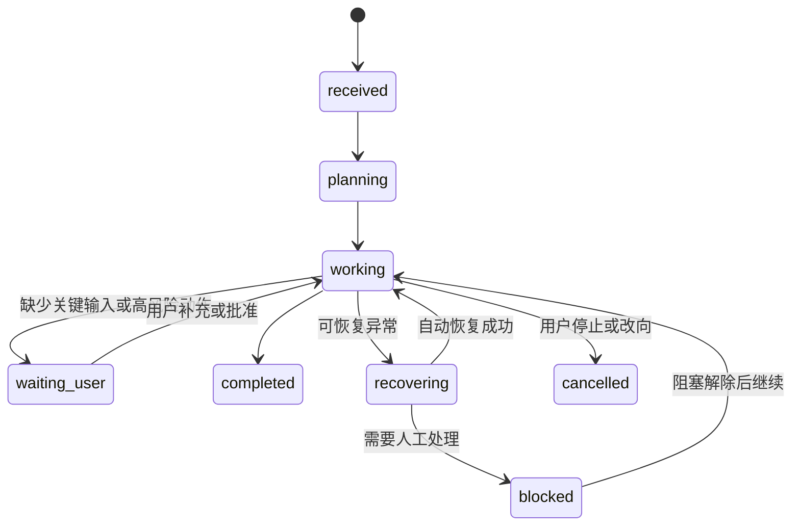

# 运营大脑 Worker 交互与可恢复 Runtime 设计

## 1. 文档状态

- 日期：2026-08-04
- 状态：产品负责人已授权按最佳实践直接定稿
- 适用范围：运营大脑主对话、工作回合、专家协作、Tool 调用、方案与内容、实时事件、异常恢复和人工待处理
- 上游约束：抖音优先；平台数据以定期批量导入为正式主链路；现阶段人工发布；不同账号的数据、对话和所有工作产物严格隔离

## 2. 目标

把运营大脑从“发送消息后等待一段时间，再出现一张难以理解的成果卡”整改为真正的数字运营 Worker：

1. 用户只与一个主 Agent 对话，任何运营问题都从这里进入。
2. 一个复杂请求始终表现为一个持续更新的工作回合。
3. 主 Agent 自动选择 Skill、专家和 Tool，并连续完成低风险内部工作。
4. 用户始终看得懂当前在做什么、已经完成什么、需要自己做什么。
5. 中断、断线、重试、补充要求和人工审批都可以从原位置继续。
6. 每次工作必须产生具体可使用的运营产物或明确可操作的阻塞原因。

本设计不以“专家数量多”“工作流复杂”或“页面卡片多”为先进标准。先进性的判断依据是：更少的人力、更快的可用交付、更高的运营指标、可恢复性和用户信任。

## 3. 核心设计决定

### 3.1 用户只看到一个主 Agent

主 Agent 是唯一对话主体。专家 Agent 是 Skill 背后的隔离执行者，Tool 是确定性动作，Runtime 负责状态、权限、重试、恢复和审计。

专家不得以多条聊天消息插入主对话。默认只显示“定位、内容策略和短视频编导正在协作”；展开“查看过程”后显示专家名称、阶段和证据摘要；再次展开才显示技术日志。

### 3.2 采用单回合工作单

每条用户消息对应一个 `WorkTurn`。复杂任务的理解、计划、执行、专家协作、质量检查、暂停和最终交付都在同一个 WorkTurn 中原位更新，不生成多套 UI，不追加重复的主 Agent 气泡。



用户可见状态必须是具体工作，例如：

- 正在读取近 30 天账号数据；
- 已确定 5 个下周选题；
- 正在编写第 4 条口播拍摄稿；
- 正在检查产品信息和账号定位是否一致；
- 等待你确认产品价格后继续；
- 已生成 5 条可直接拍摄的口播稿。

禁止使用“处理中”“执行中”“成果生成中”等无法判断进展的空泛文案。

### 3.3 删除用户侧“成果”和“采用”概念

`Artifact` 可以作为内部数据模型存在，但前端不得要求用户理解“成果对象”。

顶部信息架构改为：

- **对话**：唯一主入口和工作回合历史；
- **方案与内容**：账号体检报告、对标拆解、选题、拍摄稿、发布安排和复盘报告；
- **抖音数据**：账号、作品、粉丝、对标和数据新鲜度；
- **待处理**：需要补充、修改、拍摄、排期或手动发布的事项。

交付区必须显示具体名称与数量：

- 已生成《账号体检报告》；
- 已确定 20 个选题；
- 已生成 5 条可直接拍摄的口播稿；
- 已安排 7 天发布顺序；
- 已完成上一周期数据复盘。

禁止通用按钮“采用成果”。主按钮必须描述真实下一步：

- 根据问题制定优化计划；
- 选择选题并生成拍摄稿；
- 查看 5 条拍摄稿；
- 创建拍摄任务；
- 加入内容排期；
- 补充发布后的数据；
- 生成下一轮优化方案。

### 3.4 交付到可直接执行的程度

系统不得用“脚本”统称所有内容。根据内容类型使用明确名称：

- 口播视频：口播拍摄稿；
- 剧情或实拍视频：分镜拍摄稿；
- 产品展示：产品视频拍摄稿；
- 图文内容：图文发布稿；
- 直播：直播流程与话术稿。

一条可直接拍摄的短视频稿至少包含：选题、标题、目标、前 2 秒开场、镜头、台词、字幕、画面提示、素材、场景、时长、结尾动作和合规注意事项。

### 3.5 自动连续工作，只在真实决策处暂停

以下内部工作默认自动连续完成：查数、诊断、选题、拍摄稿生成、质量检查、证据整理和发布顺序建议。

仅在以下情况暂停：

1. 缺少会改变结论的关键输入；
2. 多个方向会造成明显不同的业务结果；
3. 即将创建或修改真实人员任务、排期、预算、价格、长期账号约束；
4. 涉及敏感内容、重大定位变化或其他高风险动作；
5. 对外发布。现阶段抖音发布必须由运营人员最终确认并手动完成。

暂停必须保存完整 `RunState`，用户稍后返回或在其他设备打开时可以从原步骤恢复，不得重新执行已完成阶段。

## 4. 消息改向与并发模型

主 Agent 自动判断运行中的新消息属于：

- **补充**：合并为当前 WorkTurn 的新约束；
- **修改**：使受影响的后续步骤失效并从最早受影响阶段重做；
- **停止**：安全取消当前工作；
- **替换目标**：终止旧方向并创建关联的新版本；
- **独立查询**：不影响当前工作，作为轻量并行查询返回。

前端必须明确显示系统判断，例如“已把‘不要讲价格’加入当前 5 条拍摄稿的要求”。用户可以撤销这次判断，但不需要先选择“追加/重做/新任务”。

同一账号采用以下并发规则：

- 只读查询可以并行；
- 内容生成可以并行，但必须写入不同产物版本；
- 修改账号长期约束、排期、人员任务和发布状态的写操作按账号串行；
- 冲突写入返回可理解的当前状态，不使用最后写入覆盖；
- 不同账号使用完全独立的执行通道。

## 5. “方案与内容”模型

用户侧只暴露业务类型，内部统一使用强类型 `Deliverable`：

| 用户看到的类型 | 内部类型 | 主要下一步 |
|---|---|---|
| 账号体检报告 | `account_diagnosis` | 制定优化计划 |
| 对标拆解 | `benchmark_analysis` | 生成差异化选题 |
| 选题清单 | `topic_plan` | 生成拍摄稿 |
| 口播/分镜/图文稿 | `production_brief` | 创建拍摄任务 |
| 发布安排 | `publishing_schedule` | 加入排期 |
| 手动发布清单 | `manual_publish_package` | 完成人工发布 |
| 数据复盘报告 | `performance_review` | 生成下一轮方案 |

每个 Deliverable 必须包含：

- `org_id + user_id + account_id + conversation_id + turn_id`；
- 类型、标题、结构化内容和当前版本；
- 数据周期、数据新鲜度、证据摘要和置信度；
- 参与的 Skill、专家和 Tool；
- 质量检查结果；
- 具体下一步动作；
- 来源版本和下游引用关系。

修改不覆盖旧内容，而是创建新版本。对话中的交付区和“方案与内容”引用同一个版本，任何修改在两处同步。

## 6. 实时交互架构

### 6.1 传输方式

主链路采用 REST 提交消息 + SSE 下发运行事件。当前需求以服务器向页面持续推送为主，SSE 比全双工 WebSocket 更简单、可观察且易于断线恢复。

事件必须持久化并包含：

```text
event_id
account_id
conversation_id
turn_id
run_id
sequence
type
business_payload
created_at
```

浏览器通过 `Last-Event-ID` 从断点继续。SSE 不可用时退化为按 `sequence` 增量拉取，禁止要求用户刷新整个页面。

### 6.2 事件类型

用户可见事件限制为：

- `turn.received`
- `turn.plan_ready`
- `step.started`
- `step.progress`
- `step.completed`
- `turn.waiting_user`
- `deliverable.updated`
- `turn.recovering`
- `turn.completed`
- `turn.blocked`
- `turn.cancelled`

模型 token 流和业务进度流分离。普通问答可以逐字流式；长任务主要推送可靠的阶段事件，不伪造“模型正在思考”。

### 6.3 前端投影

前端以 `(turn_id, sequence)` 幂等归并事件，更新同一个 WorkTurn。历史消息和乐观插入的新消息使用同一容器宽度、间距和组件，不存在“回答完成后才对齐”的第二套渲染路径。

页面重连时先读取 WorkTurn 快照，再补齐快照后的事件。快照与事件都不得按整个 BrainTask 混合不同轮次的数据。

## 7. Runtime 与可靠性

### 7.1 运行结构

```text
User Message
  → Intent + Constraint Resolver
  → Skill Contract
  → Orchestrator
      → read Tools
      → expert workers
      → evaluator / quality gate
      → side-effect approval gate
  → typed Deliverables
  → WorkTurn projection
```

主 Agent负责理解、选择、调度、纠错和汇报；正式专业结论由对应 Skill 的专家阶段产生；确定性数据和外部动作由 Tool 执行。

### 7.2 幂等与重试

所有入口和阶段使用稳定幂等键：

- 消息：`client_message_id`；
- WorkTurn：`account_id + conversation_id + client_message_id`；
- Skill：`turn_id + skill_code + input_fingerprint`；
- Tool：`run_id + step_id + tool_name + arguments_hash`；
- Deliverable：`turn_id + deliverable_type + logical_key`。

只对网络、限流和临时依赖故障自动重试，采用带抖动的指数退避并设置总时限。输入错误、权限、账号范围冲突和能力缺失不得重试。

重试必须复用原 WorkTurn、消息和交付物身份，不得重复写回复、事件、专家调用或发布任务。

### 7.3 自动恢复

Worker 心跳中断后由租约机制接管。每个有副作用的阶段先写执行意图，再通过 Outbox 发布事件，防止数据库已提交但页面状态丢失。

用户只看到：

- “连接中断，正在从第 4 条拍摄稿继续”；
- “账号数据缺少作品分享数据，请补充对应表格”；
- “拍摄任务尚未创建，你可以重试创建”。

不得暴露 `dead_letter`、HTTP 409、Harness、field_observation ID 等内部术语。

## 8. 失败与恢复体验

失败按业务可恢复性分类：

| 类型 | 系统行为 | 用户动作 |
|---|---|---|
| 临时故障 | 自动重试并从检查点继续 | 通常无需操作 |
| 数据不足 | 保留已完成工作并暂停 | 上传明确的数据文件 |
| 输入冲突 | 指出冲突的两个值 | 选择或修正具体值 |
| 权限不足 | 不执行受限动作 | 申请权限或改用可用路径 |
| 质量未达标 | 自动重做一次 | 仍失败时查看问题并修改 |
| 能力不可用 | 不伪造完成 | 使用明确替代方案 |
| 不可恢复故障 | 正确关闭所有状态 | 从最近检查点重新开始 |

错误区必须说明：完成了什么、没完成什么、原因是什么、是否保留已有内容、下一步按钮是什么。

## 9. 通知与待处理

系统不为每次专家调用发送通知，只在以下节点提醒：

- 需要用户补充信息；
- 需要高风险审批；
- 拍摄或发布时间临近；
- 工作完成；
- 自动恢复失败；
- 数据到期或需要导入。

“待处理”按动作而不是技术状态分组：待补充资料、待确认方向、待拍摄、待手动发布、待补录数据。每条事项显示账号、具体动作、截止时间、来源 WorkTurn 和完成后的下一步。

## 10. 账号隔离与删除

所有查询和写入必须同时校验组织、用户、账号和会话范围。切换账号时立即丢弃前端缓存中的当前草稿、SSE 订阅、临时附件和未提交命令。

用户只能永久删除自己的会话。二次确认后删除消息、WorkTurn、运行事件、专家与 Tool 技术日志，以及只属于该会话的临时附件。依法或业务上必须保留的审批、发布和成本审计只保留最小不可还原记录。

## 11. 性能目标

- 乐观显示用户消息：100ms 内；
- 首个明确业务状态：P95 小于 500ms；
- 普通回答首字：P95 小于 2 秒；
- 只读账号查询完成：P95 小于 2 秒；
- 长任务状态更新间隔：有进展时不超过 3 秒，无新进展时不重复刷屏；
- 页面断线重连并恢复当前 WorkTurn：P95 小于 2 秒；
- 同一消息重复回复、重复交付物和重复副作用：0；
- Turn、Run 和 Deliverable 终态不一致：0。

## 12. 可观察性与评测

技术日志与用户界面分离，但每个 WorkTurn 必须具备端到端 Trace：路由、Skill、专家、Tool、质量门、审批、模型、重试、事件投影和交付版本。

上线评测不只测回答文本，还要覆盖：

- 目标是否被正确理解；
- 是否选择正确 Skill；
- 是否读取正确账号数据；
- 是否遵守“不生成策略”等否定约束；
- 是否在需要时暂停并可恢复；
- 是否产生可直接使用的拍摄稿；
- 是否出现重复回复或状态污染；
- 用户补充要求后是否只重做受影响步骤；
- 不同账号是否完全隔离；
- 真实运营人员完成任务所需时间是否下降。

## 13. 发布策略

整改按可独立回滚的切片上线：

1. 统一术语和单 WorkTurn UI；
2. SSE 事件流、快照和断线恢复；
3. Runtime 幂等、检查点和错误分类；
4. 强类型“方案与内容”和版本关系；
5. 消息补充、修改、停止和独立查询；
6. 待处理、人工发布和通知；
7. 生产评测、灰度和旧 UI 删除。

新旧 UI 不得长期并存。每个切片通过自动化测试、真实账号冒烟、状态一致性检查和性能门后，删除对应旧路径，而不是继续叠加兼容分支。

## 14. 验收示例

用户输入：“结合最近数据和对标内容，规划并制作下周抖音内容。”

正确体验：

1. 用户消息立即对齐显示；
2. 同一条主 Agent 回复依次更新“读取数据 → 分析对标 → 确定 5 个选题 → 编写 5 条口播拍摄稿 → 质量检查 → 安排发布顺序”；
3. 用户中途说“第一条不要讲价格”，系统提示已加入当前任务，只重做受影响的拍摄稿；
4. 完成后显示“5 个选题、5 条可直接拍摄的口播稿、7 天发布安排”；
5. 按钮是“查看 5 条拍摄稿”“创建拍摄任务”“加入内容排期”；
6. 所有内容同步进入当前账号的“方案与内容”；
7. 系统不显示“成果”“采用”“脚本生成中”或内部技术错误；
8. 发布前生成明确的手动发布清单，并等待运营人员完成发布。

## 15. 参考依据

- [OpenAI Agents SDK：Streaming](https://openai.github.io/openai-agents-python/streaming/)
- [OpenAI Agents SDK：Human-in-the-loop](https://openai.github.io/openai-agents-python/human_in_the_loop/)
- [OpenAI Agents SDK：Tracing](https://openai.github.io/openai-agents-python/tracing/)
- [Anthropic：Building effective agents](https://www.anthropic.com/engineering/building-effective-agents)
- [Microsoft：Human-centered design for agents](https://learn.microsoft.com/en-us/agents/design-guidelines/human-centered-design)
- [Microsoft Agent Framework](https://learn.microsoft.com/en-us/agent-framework/overview/)

这些资料共同支持本设计采用的简单可组合工作流、中心编排者与专业 Worker、流式进度、持久暂停/恢复、工具级人工审批、检查点和端到端可观察性。
